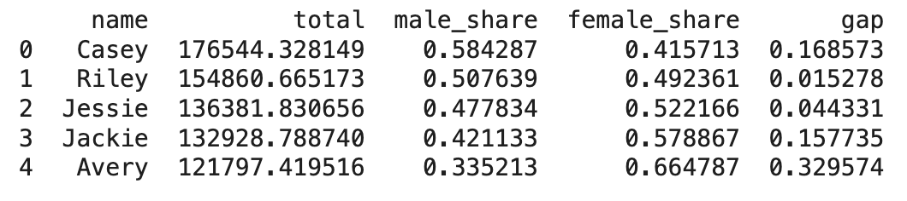
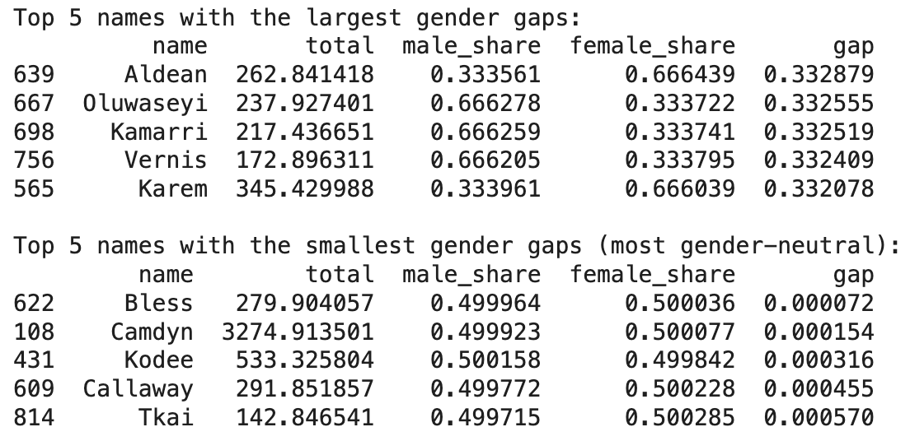

# Kayla_Haeussler_Mini_Project_9

IDS 706: Mini Project 9
Cloud-Hosted Notebook Data Manipulation
Kayla Haeussler

## Assignment Requirements
* Set up a cloud-hosted Jupyter Notebook (e.g., Google Colab)
* Perform data manipulation tasks on a sample dataset


## Setup Instructions
- Open Google Colab and sign-in
- Start a new notebook
- Run the following to clone this repo: 
```git clone https://github.com/nogibjj/Kayla_Haeussler_Mini_Project_9```
- Install necessary dependencies by running ```!pip instal -r requirements.txt```


## Tasks Performed in Notebook
The notebook loads the followinig dataset from the ```FiveThirtyEight``` repository, called unisedx_names_table.csv, containing the following variables: 
Header | Definition
---|---------
`name` | First names from the [Social Security Administration](http://www.ssa.gov/oact/babynames/limits.html)
`total` | Total number of living Americans with the name
`male_share` | Percentage of people with the name who are male
`female_share` | Percentage of people with the name who are female
`gap` | Gap between male_share and female_share

This dataset is read using pandas, based of the raw data url.  

The script then finds the 5 most popular gender neutral names in our data set, based on the ```total``` column, which yields the following results: 
  

The script also then find the names with the largest and smallest gender gaps, in a sense finding the top 5 gender neutral names that are most commonly associated with one of the genders, but are still considered gender neutral, and the gender neutral names that are the most gender neutral, which yields the following results: 
  

